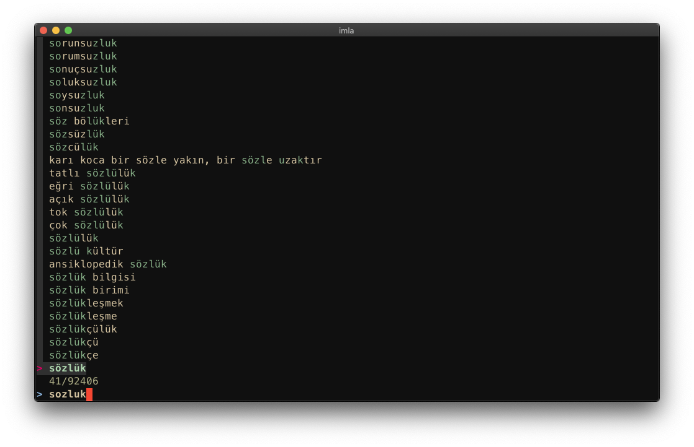

# Sozluk-gov-tr

Sozlukgovtr shows meaning of a phrase from
[sozluk.gov.tr](https://sozluk.gov.tr)

## Installation

```sh
cd sozlukgovtr
mkdir -p ~/.local/bin/
install ./sozlukgovtr ~/.local/bin/
install ./imla ~/.local/bin/
```

> Note `install sozlukgovtr <DESIRED LOCATION SHOULD BE IN THE PATH>`

## Usage

```sh
imla # opens the fzf and you can search all over the 90k phrases.
```



```sh
sozlukgovtr [ phrase ]
```

> Note `< required >` `[ optional ]`
If there are no arguments then it will read the stdandart input.

## Examples
### Basic Usage

```sh
$ sozlukgovtr merhaba
Selam
(me'rhaba:) "Geniş ve mamur yere geldiniz, rahat ediniz, günaydın, hoş geldiniz" anlamlarında bir esenleşme veya selamlaşma sözü
```

### Using with FZF

```sh
$ imla | sozlukgovtr
```
